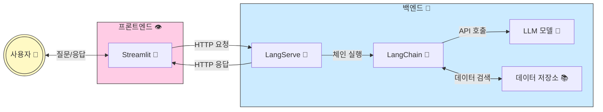

# study.langchain 
> [!IMPORTANT]
> LLM(대규모 언어 모델)을 활용한 LLM 파이프라인 구축 및 검색 증강 생성(RAG, Retrieval-Augmented Generation) 기술 학습 <br/>
> 검색 증강 생성 기법을 활용한 고급 AI 솔루션 개발 역량 강화

### RAG 요약


### LLM 애플리케이션 구조 
> [!TIP]
> [👨‍🌾 예시 코드 바로가기](#)



#### 1. 프론트엔드 영역 (분홍색)
- Streamlit (📱): 사용자 인터페이스를 제공하는 파이썬 기반 웹 프레임워크
  - 사용자 입력 수집 및 결과 표시
  - HTTP 요청을 통해 백엔드와 통신
 
#### 2. 백엔드 영역 (파란색)
- LangServe (🚀): 파이썬 백엔드 프레임워크(FastAPI 기반)
  - LangChain 컴포넌트를 REST API로 노출
  - 프론트엔드의 HTTP 요청 처리
- LangChain (🔗): LLM 애플리케이션 로직 처리
  - 체인과 에이전트를 통한 복잡한 워크플로우 관리
  - LLM 호출 및 데이터 처리 로직
- LLM 모델 (🤖): GPT, Claude 등의 대규모 언어 모델
  - API를 통해 텍스트 생성 및 처리
- 데이터 저장소 (📚): 벡터 DB 및 일반 데이터베이스
  - 문서, 임베딩, 사용자 데이터 저장 및 검색
 
#### 데이터 흐름
```
1. 사용자가 Streamlit 인터페이스를 통해 질문 입력
2. Streamlit이 HTTP 요청으로 LangServe에 전송
3. LangServe가 LangChain 컴포넌트 실행
4. LangChain이 LLM API 호출 및 필요시 데이터 저장소 접근
5. 결과가 역순으로 다시 사용자에게 전달
```
