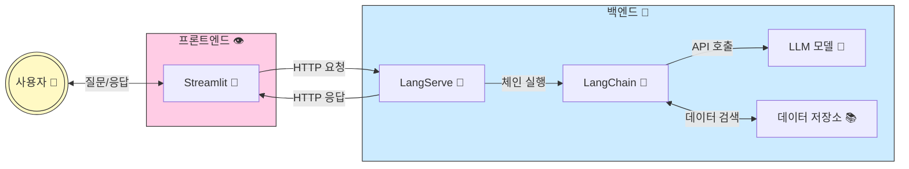

# study.langchain 
> [!IMPORTANT]
> LLM(대규모 언어 모델)을 활용한 LLM 파이프라인 구축 및 검색 증강 생성(RAG, Retrieval-Augmented Generation) 기술 학습 <br/>
> 검색 증강 생성 기법을 활용한 고급 AI 솔루션 개발 역량 강화

---
### 🧑🏼‍🌾 학습 일지
- [#1. RAG 트랜드](https://github.com/hyunolike/study.langchain/blob/develop/RAG%20%ED%8A%B8%EB%9E%9C%EB%93%9C.md)
- [#2. LLM & RAG 시스템 아키텍처 예](https://github.com/hyunolike/study.langchain/blob/develop/%ED%95%99%EC%8A%B5-%EC%9D%BC%EC%A7%80/LLM-RAG%20%EC%8B%9C%EC%8A%A4%ED%85%9C%20%EC%95%84%ED%82%A4%ED%85%8D%EC%B2%98.md)
- [#3. MCP (Model Context Protocal)](https://github.com/hyunolike/study.langchain/blob/develop/%ED%95%99%EC%8A%B5-%EC%9D%BC%EC%A7%80/MCP.md)


---


### LLM 개발 요약


### RAG 요약


### LLM 애플리케이션 구조 
> [!TIP]
> [👨‍🌾 예시 코드 바로가기](https://github.com/hyunolike/study.langchain/tree/develop/%EC%98%88%EC%8B%9C%20%EC%BD%94%EB%93%9C/LLM%20%EC%95%A0%ED%94%8C%EB%A6%AC%EC%BC%80%EC%9D%B4%EC%85%98%20%EA%B5%AC%ED%98%84%20%EC%98%88%EC%8B%9C%20%EC%BD%94%EB%93%9C) <br/>


<details> <summary>👨‍🌾 API 명세서</summary>    

# LLM 애플리케이션 API 명세서

## 기본 정보
- **기본 URL**: `http://localhost:8000`
- **인증**: API 키 기반 (헤더에 `Authorization: Bearer YOUR_API_KEY` 형식으로 전달)
- **응답 형식**: JSON
- **버전**: v1

## 엔드포인트

### 1. 질의응답 API

#### 요청 정보
- **URL**: `/api/qa/invoke`
- **메서드**: POST
- **헤더**:
  ```
  Content-Type: application/json
  Authorization: Bearer YOUR_API_KEY (선택적)
  ```

#### 요청 본문
```json
"질문 내용"
```

#### 응답
- **성공 (200 OK)**
  ```json
  "질문에 대한 AI 응답 내용"
  ```

- **오류 (400 Bad Request)**
  ```json
  {
    "error": "입력이 유효하지 않습니다",
    "details": "질문이 비어 있거나 유효하지 않습니다"
  }
  ```

- **오류 (401 Unauthorized)**
  ```json
  {
    "error": "인증 오류",
    "details": "유효하지 않은 API 키입니다"
  }
  ```

#### 예시
- **요청**:
  ```bash
  curl -X POST \
    http://localhost:8000/api/qa/invoke \
    -H 'Content-Type: application/json' \
    -d '"인공지능은 어떻게 작동하나요?"'
  ```

- **응답**:
  ```json
  "인공지능은 기본적으로 데이터를 학습하여 패턴을 인식하고 예측을 수행하는 시스템입니다. 현대 AI의 핵심인 딥러닝은 뉴런의 작동 방식에서 영감을 얻은 인공 신경망을 사용합니다. 이 신경망은 입력 데이터를 여러 계층으로 처리하며, 각 계층은 데이터의 다른 특성을 학습합니다. 대규모 데이터셋으로 훈련되면, AI는 새로운 입력에 대해 적절한 출력을 생성할 수 있게 됩니다."
  ```

### 2. 고급 질의응답 API

#### 요청 정보
- **URL**: `/api/advanced_qa/invoke`
- **메서드**: POST
- **헤더**:
  ```
  Content-Type: application/json
  Authorization: Bearer YOUR_API_KEY (선택적)
  ```

#### 요청 본문
```json
{
  "query": "질문 내용",
  "include_sources": true,
  "temperature": 0.2
}
```

#### 응답
- **성공 (200 OK)**
  ```json
  {
    "answer": "질문에 대한 AI 응답 내용",
    "sources": [
      {
        "title": "소스 문서 제목",
        "url": "소스 URL",
        "chunk_id": "청크 ID",
        "relevance_score": 0.92
      }
    ],
    "processing_time": 1.24
  }
  ```

#### 예시
- **요청**:
  ```bash
  curl -X POST \
    http://localhost:8000/api/advanced_qa/invoke \
    -H 'Content-Type: application/json' \
    -d '{
      "query": "양자 컴퓨팅의 기본 원리는 무엇인가요?",
      "include_sources": true,
      "temperature": 0.1
    }'
  ```

- **응답**:
  ```json
  {
    "answer": "양자 컴퓨팅은 양자역학의 원리를 이용하여 정보를 처리하는 컴퓨팅 방식입니다. 기존 컴퓨터가 비트(0 또는 1)를 사용하는 반면, 양자 컴퓨터는 큐비트(quantum bit)를 사용합니다. 큐비트는 중첩 상태(superposition)가 가능해 0과 1의 모든 가능한 조합을 동시에 나타낼 수 있습니다. 또한 얽힘(entanglement) 현상을 통해 큐비트 간 상호작용이 발생하여 병렬 처리 능력이 획기적으로 증가합니다. 이론적으로 특정 문제에서 기존 컴퓨터보다 지수적으로 빠른 계산이 가능합니다.",
    "sources": [
      {
        "title": "양자 컴퓨팅 기초",
        "url": "https://example.com/quantum-basics",
        "chunk_id": "qc-12345",
        "relevance_score": 0.95
      },
      {
        "title": "양자역학과 컴퓨팅",
        "url": "https://example.com/quantum-mechanics",
        "chunk_id": "qm-67890",
        "relevance_score": 0.87
      }
    ],
    "processing_time": 1.57
  }
  ```

### 3. 대화 이력 관리 API

#### 요청 정보
- **URL**: `/api/chat/invoke`
- **메서드**: POST
- **헤더**:
  ```
  Content-Type: application/json
  Authorization: Bearer YOUR_API_KEY (선택적)
  ```

#### 요청 본문
```json
{
  "message": "사용자 메시지",
  "conversation_id": "회화_ID",
  "streaming": true
}
```

#### 응답
- **성공 (200 OK) - 스트리밍 비활성화**
  ```json
  {
    "response": "AI 응답 메시지",
    "conversation_id": "conv_12345",
    "created_at": "2025-03-09T14:30:45Z"
  }
  ```

- **성공 (200 OK) - 스트리밍 활성화**
  ```
  data: {"chunk": "AI ", "finish_reason": null}
  
  data: {"chunk": "응답 ", "finish_reason": null}
  
  data: {"chunk": "메시지", "finish_reason": null}
  
  data: {"chunk": "", "finish_reason": "stop", "conversation_id": "conv_12345"}
  ```

#### 예시
- **요청**:
  ```bash
  curl -X POST \
    http://localhost:8000/api/chat/invoke \
    -H 'Content-Type: application/json' \
    -d '{
      "message": "인공지능의 미래에 대해 어떻게 생각하시나요?",
      "conversation_id": "conv_12345",
      "streaming": false
    }'
  ```

- **응답**:
  ```json
  {
    "response": "인공지능의 미래는 매우 유망하면서도 신중하게 접근해야 합니다. 향후 10-20년 내에 AI는 의료, 교육, 교통, 과학 연구 등 거의 모든 산업 분야에 깊이 통합될 것으로 예상됩니다. 인간과 AI의 협업으로 복잡한 문제 해결 능력이 크게 향상될 것이며, 개인화된 서비스로 삶의 질을 높일 수 있습니다. 다만 이러한 발전 과정에서 윤리적 문제, 일자리 변화, 프라이버시 침해 등의 도전 과제도 함께 고려해야 합니다. 균형 잡힌 규제와 투명한 개발 과정이 중요할 것입니다.",
    "conversation_id": "conv_12345",
    "created_at": "2025-03-09T14:35:22Z"
  }
  ```

### 4. 문서 처리 API

#### 요청 정보
- **URL**: `/api/documents/process`
- **메서드**: POST
- **헤더**:
  ```
  Authorization: Bearer YOUR_API_KEY
  ```
- **Content-Type**: `multipart/form-data`

#### 요청 파라미터
- `file`: 처리할 문서 파일 (PDF, TXT, DOCX 등)
- `custom_id` (선택적): 문서 ID 지정
- `chunk_size` (선택적): 문서 청크 크기 (기본값: 1000)
- `chunk_overlap` (선택적): 청크 오버랩 크기 (기본값: 200)

#### 응답
- **성공 (200 OK)**
  ```json
  {
    "document_id": "doc_12345",
    "status": "processed",
    "chunks": 15,
    "vectors": 15,
    "metadata": {
      "filename": "example.pdf",
      "size_bytes": 1024000,
      "mime_type": "application/pdf",
      "page_count": 25
    }
  }
  ```

#### 예시
- **요청**:
  ```bash
  curl -X POST \
    http://localhost:8000/api/documents/process \
    -H 'Authorization: Bearer YOUR_API_KEY' \
    -F 'file=@/path/to/document.pdf' \
    -F 'chunk_size=800' \
    -F 'chunk_overlap=100'
  ```

- **응답**:
  ```json
  {
    "document_id": "doc_9a8b7c",
    "status": "processed",
    "chunks": 32,
    "vectors": 32,
    "metadata": {
      "filename": "document.pdf",
      "size_bytes": 2048576,
      "mime_type": "application/pdf",
      "page_count": 18,
      "processed_at": "2025-03-09T15:22:45Z"
    }
  }
  ```

## 상태 코드

- `200 OK`: 요청이 성공적으로 처리됨
- `400 Bad Request`: 요청 형식이 잘못되었거나 필요한 파라미터가 없음
- `401 Unauthorized`: 인증 실패 (API 키 문제)
- `404 Not Found`: 요청한 리소스를 찾을 수 없음
- `429 Too Many Requests`: 요청 한도 초과
- `500 Internal Server Error`: 서버 내부 오류

## 제한 사항

- 요청 크기: 최대 10MB
- 초당 요청 수: 최대 10회
- 토큰 제한: 요청당 최대 4,000 토큰, 응답당 최대 8,000 토큰
</details>




#### 1. 프론트엔드 영역 (분홍색)
- Streamlit (📱): 사용자 인터페이스를 제공하는 파이썬 기반 웹 프레임워크
  - 사용자 입력 수집 및 결과 표시
  - HTTP 요청을 통해 백엔드와 통신
 
#### 2. 백엔드 영역 (파란색)
- LangServe (🚀): 파이썬 백엔드 프레임워크(FastAPI 기반)
  - LangChain 컴포넌트를 REST API로 노출
  - 프론트엔드의 HTTP 요청 처리
- LangChain (🔗): LLM 애플리케이션 로직 처리
  - 체인과 에이전트를 통한 복잡한 워크플로우 관리
  - LLM 호출 및 데이터 처리 로직
- LLM 모델 (🤖): GPT, Claude 등의 대규모 언어 모델
  - API를 통해 텍스트 생성 및 처리
- 데이터 저장소 (📚): 벡터 DB 및 일반 데이터베이스
  - 문서, 임베딩, 사용자 데이터 저장 및 검색
 
#### 데이터 흐름
```
1. 사용자가 Streamlit 인터페이스를 통해 질문 입력
2. Streamlit이 HTTP 요청으로 LangServe에 전송
3. LangServe가 LangChain 컴포넌트 실행
4. LangChain이 LLM API 호출 및 필요시 데이터 저장소 접근
5. 결과가 역순으로 다시 사용자에게 전달
```

#### 👨‍🌾 예시 코드
##### 1. LangServe 백엔드 (app.py)
```
FastAPI 앱 생성: 웹 API 서버 설정
문서 처리: 텍스트 문서를 로드하고 청크로 분할
벡터 저장소: 문서 임베딩을 Chroma DB에 저장
LangChain 체인: 질문-답변(QA) 체인 구성
API 라우트 설정: LangServe를 사용하여 체인을 API 엔드포인트로 노출
CORS 설정: 프론트엔드에서 API 접근 허용
```

```python
# 체인 구성
model = ChatOpenAI(model="gpt-4")
chain = (
    {"context": retriever, "question": RunnablePassthrough()}
    | prompt
    | model
    | StrOutputParser()
)

# LangServe로 API 엔드포인트 추가
add_routes(app, {"qa": chain}, path="/api")
```

##### 2. Streamlit 프론트엔드 (streamlit_app.py)
```
페이지 구성: 제목, 설명, 레이아웃 설정
사용자 입력: 텍스트 입력 필드 제공
API 호출: 백엔드 LangServe API 호출 처리
결과 표시: AI 응답 및 메타데이터 시각화
사용자 피드백: 반응 및 의견 수집 기능
```


```python
# API 요청 전송
response = requests.post(API_URL, headers=headers, data=payload)
            
if response.status_code == 200:
    # 응답 처리
    result = response.json()
    
    # 결과 표시
    st.subheader("답변:")
    st.write(result)
```


##### 3. LangChain 고급 체인 (chains.py)
```
고급 검색: MMR(Maximum Marginal Relevance) 검색 및 컨텍스트 압축
대화 기억: 이전 대화 기록 유지
스트리밍: 실시간 응답 스트리밍
소스 추적: 응답 소스 문서 기록
```


```python
# 컨텍스트 압축 검색기
return ContextualCompressionRetriever(
    base_compressor=compressor,
    base_retriever=base_retriever
)
```

#### API 명세서 요약
##### 주요 엔드포인트
1. 기본 질의응답 API (/api/qa/invoke)
    - 간단한 질문을 전송하고 AI 응답을 받는 기본 인터페이스
    - 스트링 형태의 단순한 요청/응답 구조
2. 고급 질의응답 API (/api/advanced_qa/invoke)
    - 소스 정보, 온도 설정 등 추가 옵션이 있는 고급 질의응답
    - 참조 소스와 메타데이터가 포함된 풍부한 응답 제공
3. 대화 이력 관리 API (/api/chat/invoke)
    - 대화 컨텍스트를 유지하는 채팅 인터페이스
    - 스트리밍 옵션 지원으로 실시간 응답 가능
4. 문서 처리 API (/api/documents/process)
    - 문서 업로드 및 벡터 DB 처리를 위한 인터페이스
    - 문서 메타데이터와 처리 결과 반환
    - 

---
### 👨‍🌾 파이썬 개발 환경 준비 요약 (참고)


